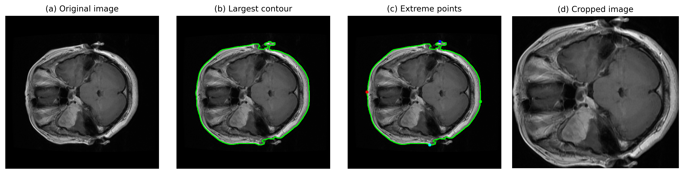
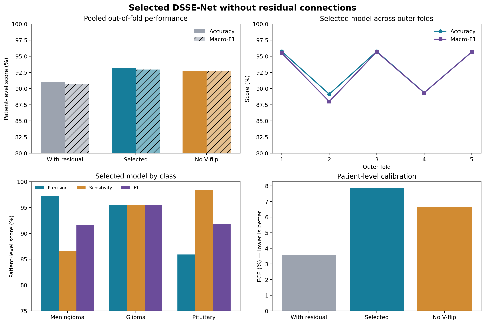
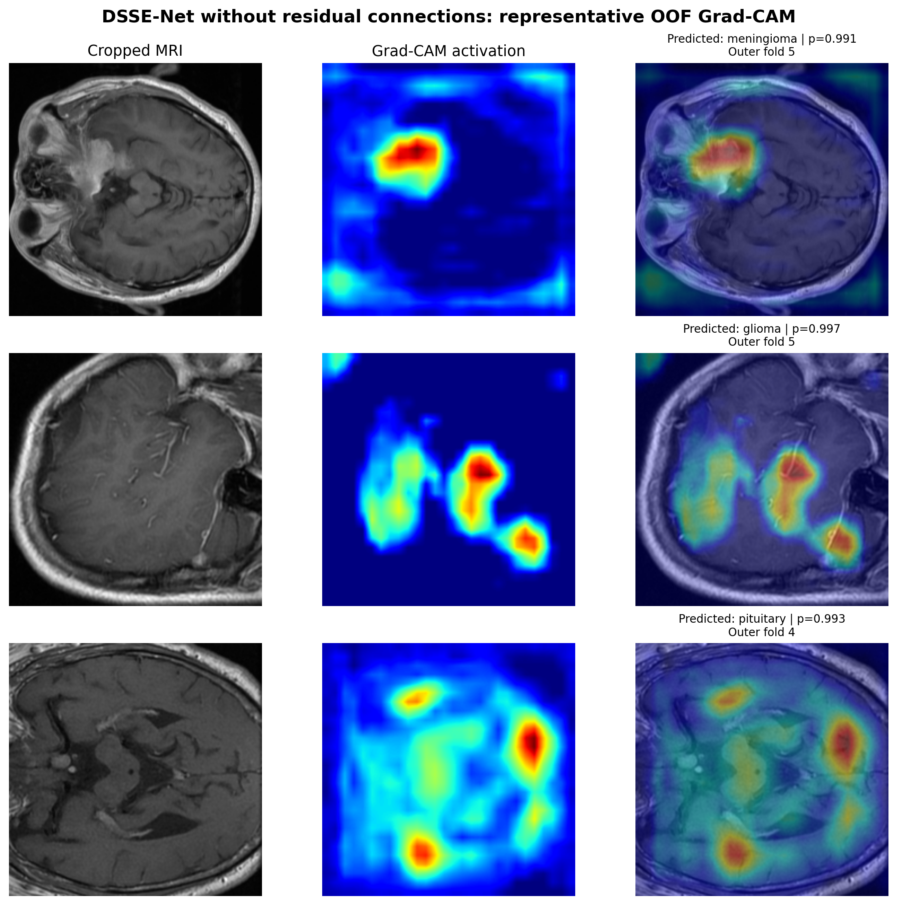

# 🧠 DSSE-Net

**A compact residual-free Depthwise Squeeze-and-Excitation network for patient-level brain tumor classification from contrast-enhanced MRI.**

This repository contains the reproducible PyTorch workflow accompanying the manuscript:

> **DSSE-Net: A Compact Depthwise Squeeze-and-Excitation Network for Patient-Level Brain Tumor Classification**

The selected DSSE-Net architecture is trained from scratch and evaluated with nested stratified patient-level `5 × 5` cross-validation. The workflow includes image decoding and cropping, manual quality-control manifests, leakage checks, nested-fold construction, training, patient-level out-of-fold evaluation, component ablation, pretrained CNN baselines, paired statistical testing, calibration analysis, and representative Grad-CAM visualization.

> ⚠️ **Research use only:** this model is an internally validated research prototype. It has not been externally validated and must not be used for clinical diagnosis or patient care.

## ✨ Highlights

- 👤 **Patient-level separation:** slices belonging to the same patient never cross training, validation, or locked test partitions.
- 🔁 **Nested `5 × 5` evaluation:** five outer folds estimate generalization; five inner folds inside each outer development set select the training duration.
- 🪶 **Compact model:** 287,881 trainable parameters and 0.299 GFLOPs for a `1 × 224 × 224` input.
- 🧱 **Residual-free final architecture:** the ablation analysis identified removal of residual shortcuts as the best DSSE-Net configuration.
- 📊 **Patient-level primary endpoint:** one pooled out-of-fold prediction is produced for every patient.
- 🧪 **Controlled comparisons:** five ImageNet-pretrained CNN baselines and six one-factor ablation controls use the same patient partitions.
- 📈 **Statistical testing:** exact two-sided McNemar tests with Holm correction use paired patient-level OOF predictions.
- 🔍 **Explainability:** representative Grad-CAM examples are provided as qualitative model-inspection evidence.

## 🗂️ Repository contents

| Path | Purpose |
|---|---|
| [`DSSE_Net_Nested_CV.ipynb`](DSSE_Net_Nested_CV.ipynb) | Main end-to-end notebook: data preparation, nested CV, training, evaluation, ablation, baselines, and Grad-CAM. |
| [`dsse_primary.py`](dsse_primary.py) | Compact helpers for loading and presenting the selected residual-free model results. |
| [`export_ablation_learning_curves.py`](export_ablation_learning_curves.py) | Rebuilds supplementary learning-curve figures from saved inner-fold histories. |
| [`going_modular/going_modular`](going_modular/going_modular) | Supporting data-loading, training, evaluation, prediction, and utility modules. |
| [`nested_cv_artifacts`](nested_cv_artifacts) | Reproducibility manifests, fold membership, preprocessing configuration, QC records, and data summaries. |
| `nested_cv_*_results/` | Compact experiment configurations, histories, OOF summaries, figures, and comparison tables. Model weights are intentionally excluded from Git. |

Large raw data, duplicated fold images, checkpoints, and legacy single-split experiments are excluded by [`.gitignore`](.gitignore).

## 📌 Repository root

Upload the **contents** of the local `zubNet-A` directory directly to the GitHub repository root. Do not create an additional `zubNet-A/` level inside the repository. The expected top level is therefore:

```text
<repository-root>/
├── README.md
├── .gitignore
├── DSSE_Net_Nested_CV.ipynb
├── dsse_primary.py
├── export_ablation_learning_curves.py
├── going_modular/
├── nested_cv_artifacts/
└── nested_cv_*_results/
```

All links and paths in this README are relative to that repository root.

## 🧠 Model architecture

The final model is the **residual-free DSSE-Net**. Each DSSE block applies:

1. `1 × 1` pointwise convolution, batch normalization, and ReLU;
2. `3 × 3` depthwise convolution, batch normalization, and ReLU;
3. squeeze-and-excitation channel recalibration;
4. spatial dropout with probability `0.1`;
5. ReLU activation, **without a residual shortcut addition**.

The complete network is:

| Stage | Operation | Output channels / units |
|---|---|---:|
| Input | Grayscale CE-MRI resized to `224 × 224` | 1 |
| Stem | `3 × 3`, stride-2 convolution + BN + ReLU | 32 |
| Stage 1 | 2 residual-free DSSE blocks | 32 |
| Downsample 1 | `1 × 1`, stride-2 convolution | 96 |
| Stage 2 | 3 residual-free DSSE blocks | 96 |
| Downsample 2 | `1 × 1`, stride-2 convolution | 192 |
| Stage 3 | 4 residual-free DSSE blocks | 192 |
| Head | Global average pooling → FC 256 → BN → ReLU → dropout `0.5` | 256 |
| Output | Linear classifier | 3 logits |

The output layer returns **logits**. Softmax is applied only when probabilities are required for inference, patient-level pooling, calibration, ROC-AUC, or visualization.

## 🧬 Dataset

The experiments use the public Cheng contrast-enhanced MRI brain tumor dataset available from Figshare: [doi:10.6084/m9.figshare.1512427.v5](https://doi.org/10.6084/m9.figshare.1512427.v5).

### Final study cohort

| Class | Class index | Patients | Images after QC |
|---|---:|---:|---:|
| Meningioma | 0 | 82 | 701 |
| Glioma | 1 | 89 | 1,310 |
| Pituitary | 2 | 62 | 920 |
| **Total** | — | **233** | **2,931** |

The original dataset contains 3,064 slices from the same 233 patients. After automated cropping, 133 images with unsatisfactory preprocessing results were excluded through manual visual quality control. The patient cohort was retained, and all folds were rebuilt from the post-QC image manifest.

The exact class mapping is:

```python
CLASS_TO_INDEX = {
    "meningioma": 0,
    "glioma": 1,
    "pituitary": 2,
}
```

### Cropping and preprocessing

The cropping pipeline converts each MRI slice to grayscale, applies a `5 × 5` Gaussian blur, thresholds the image at `45`, performs two erosion and two dilation iterations, selects the largest external contour, identifies its extreme points, and crops the corresponding brain region. Images are resized to `224 × 224` with bilinear interpolation when loaded by the model.

<p align="center">
  
</p>

The exact settings and audit records are stored in:

- [`cropping_config.json`](nested_cv_artifacts/cropping_config.json)
- [`manual_quality_exclusions.csv`](nested_cv_artifacts/manual_quality_exclusions.csv)
- [`quality_control_manifest.csv`](nested_cv_artifacts/quality_control_manifest.csv)
- [`split_config.json`](nested_cv_artifacts/split_config.json)
- [`outer_fold_assignment.csv`](nested_cv_artifacts/outer_fold_assignment.csv)
- [`inner_split_membership.csv`](nested_cv_artifacts/inner_split_membership.csv)

## 🔁 What does nested patient-level `5 × 5` CV mean?

This notation does **not** mean 25 independent test folds.

For each of the five outer folds:

1. One patient-level outer fold is locked as the test set.
2. The remaining patients form the outer development set.
3. The development set is divided into five inner patient-level folds.
4. Five inner models are trained to select the best epoch using validation macro F1.
5. The median of the five selected epochs is used to train a fresh model on the complete outer development set.
6. That model is evaluated once on the locked outer test fold.

Therefore, one model configuration requires:

- `5 × 5 = 25` inner-fold training runs; and
- `5` final outer-development refits;
- **30 fitted models in total**.

Every patient appears in a locked outer test set exactly once. Slice probabilities are averaged within each patient, and the class with the highest mean probability becomes that patient's OOF prediction. The five locked outer-test outputs are then pooled for the primary analysis.

## ⚙️ Training configuration

### Selected DSSE-Net

| Setting | Value |
|---|---|
| Initialization | From scratch |
| Optimizer | Adam |
| Loss | Cross-entropy |
| Initial/fixed learning rate | `0.001` |
| Learning-rate scheduler | None |
| Weight decay | `1 × 10⁻⁴` |
| Batch size | 32 |
| Maximum inner-fold epochs | 50 |
| Selection metric | Validation macro F1 |
| Base random seed | 42 |
| Input tensor | `1 × 224 × 224`, values scaled to `[0, 1]` |

Training-only augmentation consists of random rotation within `±20°`, horizontal flipping with probability `0.5`, and vertical flipping with probability `0.5`. Random augmentation is never applied to inner validation or locked outer test images.

### Pretrained baselines

The baseline CNNs use ImageNet-1K initialization and full fine-tuning with learning rate `1 × 10⁻⁴`. Grayscale MRI slices are replicated to three channels and normalized with the standard ImageNet mean and standard deviation. All other split, augmentation, selection, refit, and locked-test rules match the DSSE-Net protocol.

## 📊 Main results

### Pooled patient-level OOF performance

| Metric | Result |
|---|---:|
| Correct patients | 217 / 233 |
| Accuracy | **93.13%** |
| 95% patient-cluster bootstrap CI for accuracy | **89.70–96.14%** |
| Balanced accuracy | **93.49%** |
| Macro F1 | **0.9295** |
| 95% bootstrap CI for macro F1 | **0.8953–0.9598** |
| Macro one-vs-rest ROC-AUC | **0.9936** |
| Expected calibration error, 10 bins | 7.87% |
| Parameters | **0.288 M** |
| Compute | **0.299 GFLOPs** |

The five outer-fold patient accuracies were `95.74%`, `89.13%`, `95.74%`, `89.36%`, and `95.65%` (standard deviation: `3.54` percentage points).

The secondary slice-level analysis achieved `91.61%` accuracy and `0.9077` macro F1.

### Patient-level performance by class

| Class | Precision | Sensitivity / recall | Specificity | F1 | Support |
|---|---:|---:|---:|---:|---:|
| Meningioma | 0.9726 | 0.8659 | 0.9868 | 0.9161 | 82 |
| Glioma | 0.9551 | 0.9551 | 0.9722 | 0.9551 | 89 |
| Pituitary | 0.8592 | 0.9839 | 0.9415 | 0.9173 | 62 |

<p align="center">
  
</p>

The machine-readable primary metrics are available in [`oof_patient_level_overall_metrics.json`](nested_cv_ablation_results/split_ablation/without_residual/oof_evaluation/oof_patient_level_overall_metrics.json).

## 🆚 Baseline comparison

All baselines were fully fine-tuned from ImageNet-1K weights using the same nested patient partitions. Holm-adjusted p-values are from exact two-sided McNemar tests against the selected residual-free DSSE-Net.

| Model | Training | Accuracy | Macro F1 | Parameters | GFLOPs | Holm-adjusted p |
|---|---|---:|---:|---:|---:|---:|
| **DSSE-Net, residual-free** | From scratch | **93.13%** | **0.9295** | **0.288 M** | **0.299** | — |
| ResNet-50 | ImageNet full fine-tuning | 95.71% | 0.9577 | 23.514 M | 4.132 | 0.7300 |
| DenseNet-121 | ImageNet full fine-tuning | 95.28% | 0.9525 | 6.957 M | 2.896 | 1.0000 |
| MobileNetV3-Large | ImageNet full fine-tuning | 94.42% | 0.9448 | 4.206 M | 0.234 | 1.0000 |
| EfficientNet-B0 | ImageNet full fine-tuning | 95.28% | 0.9510 | 4.011 M | 0.414 | 1.0000 |
| RegNet-Y-400MF | ImageNet full fine-tuning | 94.42% | 0.9447 | 3.904 M | 0.418 | 1.0000 |

None of the five paired differences was statistically significant after Holm correction at `α = 0.05`. These comparisons support a compact performance–complexity trade-off; they do not establish equivalence or superiority.

Full compact tables:

- [`baseline_results_summary.csv`](nested_cv_baseline_results/split_baseline/tables/baseline_results_summary.csv)
- [`paired_patient_mcnemar_holm_vs_without_residual.csv`](nested_cv_baseline_results/split_baseline/tables/paired_patient_mcnemar_holm_vs_without_residual.csv)

## 🧪 Residual-free ablation study

The selected residual-free model is the reference. Each row changes one design choice while preserving the nested patient-level protocol.

| Configuration | Accuracy | Δ accuracy | Macro F1 | Macro ROC-AUC | Parameters | GFLOPs | Holm p |
|---|---:|---:|---:|---:|---:|---:|---:|
| **Selected residual-free DSSE-Net** | **93.13%** | — | **0.9295** | **0.9936** | 0.2879 M | 0.2991 | — |
| Add residual connections | 90.99% | −2.15 pp | 0.9073 | 0.9904 | 0.2879 M | 0.2991 | 1.0000 |
| Remove vertical flip | 92.70% | −0.43 pp | 0.9272 | 0.9928 | 0.2879 M | 0.2991 | 1.0000 |
| Remove SE attention | 89.70% | −3.43 pp | 0.8963 | 0.9891 | 0.2645 M | 0.2967 | 0.5766 |
| Replace depthwise with standard `3 × 3` convolution | 80.26% | −12.88 pp | 0.8026 | 0.9682 | 1.8722 M | 2.3303 | **4.16 × 10⁻⁷** |
| Remove dropout | 91.85% | −1.29 pp | 0.9193 | 0.9868 | 0.2879 M | 0.2991 | 1.0000 |
| Remove all augmentation | 90.56% | −2.58 pp | 0.9068 | 0.9892 | 0.2879 M | 0.2991 | 1.0000 |

Only replacement of depthwise convolution with standard convolution remained significant after Holm correction.

Full compact tables:

- [`ablation_results_summary_vs_without_residual.csv`](nested_cv_ablation_results/split_ablation_without_residual_reference/tables/ablation_results_summary_vs_without_residual.csv)
- [`paired_patient_mcnemar_holm_vs_without_residual.csv`](nested_cv_ablation_results/split_ablation_without_residual_reference/tables/paired_patient_mcnemar_holm_vs_without_residual.csv)

## 🔍 Grad-CAM

The notebook generates representative Grad-CAM overlays from held-out OOF cases for the selected residual-free model. These images are intended for qualitative inspection of model attention and are **not** presented as quantitative tumor-localization evidence.

<p align="center">
  
</p>

Cross-fold Grad-CAM dispersion and Grad-CAM++/LayerCAM comparison code are not part of the cleaned release because they are not reported as study results in the manuscript.

## 🚀 Installation

### Option A: use the existing Conda environment

The original experiments were run in the Conda environment named `dl`:

```bash
conda activate dl
python -m pip install jupyterlab ipykernel
python -m ipykernel install --user --name dl --display-name "Python (dl)"
```

### Option B: create a fresh environment

```bash
conda create -n dsse-net python=3.10 -y
conda activate dsse-net
```

Install PyTorch and torchvision using the command appropriate for your operating system and CUDA version from the [official PyTorch installation guide](https://pytorch.org/get-started/locally/). Then install the remaining dependencies:

```bash
python -m pip install torchinfo statsmodels numpy opencv-python pandas matplotlib scikit-learn seaborn thop h5py tqdm pillow jupyterlab ipykernel grad-cam
python -m ipykernel install --user --name dsse-net --display-name "Python (dsse-net)"
```

The reference machine used Python `3.10.18`, PyTorch `2.7.1+cu128`, torchvision `0.22.1+cu128`, NumPy `2.2.6`, pandas `2.3.2`, scikit-learn `1.7.1`, and h5py `3.15.1`. Training was performed on an NVIDIA GeForce RTX 5080 with 16 GB VRAM.

## ▶️ Running the code

### 1. Clone and enter the repository

Replace the placeholders with the final GitHub account and repository name:

```bash
git clone https://github.com/<YOUR-USERNAME>/<YOUR-REPOSITORY>.git
cd <YOUR-REPOSITORY>
```

### 2. Add the raw dataset

Download the Figshare dataset and place the 3,064 `.mat` files directly under:

```text
brainDataset/
├── 1.mat
├── 2.mat
├── ...
└── 3064.mat
```

Do not commit this directory. It is excluded by `.gitignore` and must be obtained from the original data provider.

### 3. Start Jupyter

```bash
conda activate dl
jupyter lab DSSE_Net_Nested_CV.ipynb
```

Select the `Python (dl)` kernel.

### 4. Prepare the data

Run the notebook from the beginning through Section 11 in order. These sections:

- decode the `.mat` files and read patient metadata;
- validate class and patient manifests;
- create outer and inner patient-level assignments;
- verify leakage, coverage, and class consistency;
- export PNG images;
- apply the documented cropping pipeline;
- apply the stored manual QC exclusion manifest;
- rebuild post-QC folds; and
- create training, validation, development, and locked-test DataLoaders.

To reproduce the published 2,931-image cohort, keep the supplied `nested_cv_artifacts/manual_quality_exclusions.csv`. Removing or changing this file changes the cohort, split hash, and downstream results.

### 5. Inspect the saved publication results

All expensive execution switches are `False` by default. With the compact result artifacts present, run the **Primary saved results** and **Grad-CAM** display cells near the top of the notebook to inspect the frozen study outputs.

Checkpoints are excluded from Git. The saved Grad-CAM PNG can be viewed without them, but regenerating Grad-CAM requires the trained outer-fold checkpoint files.

### 6. Retrain the selected residual-free configuration

One complete configuration performs 30 model fits and can take substantial GPU time. After running through the ablation definitions in Section 18, execute the following in a new cell:

```python
ABLATION_VARIANTS["selected_without_residual"] = {
    "label": "Selected DSSE-Net (without residual)",
    "description": "Residual-free reference configuration.",
    "use_se": True,
    "use_residual": False,
    "use_depthwise": True,
    "block_dropout": 0.1,
    "head_dropout": 0.5,
    "use_augmentation": True,
    "use_vertical_flip": True,
}

primary_reproduction = run_single_ablation_variant(
    "selected_without_residual",
    training_config=ABLATION_TRAINING_CONFIG,
    resume_completed=True,
)
```

The rerun is stored under:

```text
nested_cv_ablation_results/
└── split_ablation_without_residual_reference/
    └── selected_without_residual/
```

### 7. Run the remaining experiments

Change only the required execution switch and keep unrelated switches disabled:

| Experiment | Notebook setting |
|---|---|
| With-residual control | `RUN_WITH_RESIDUAL_CONTROL = True` |
| Four residual-free component ablations | `RUN_ABLATION_STUDY = True` |
| Five pretrained CNN baselines | `RUN_BASELINE_COMPARISON = True` |
| No-residual, no-vertical-flip control | `RUN_DSSE_NET_NO_RESIDUAL = True` |

For a short verification run, restrict the corresponding list before enabling training, for example:

```python
ABLATION_VARIANTS_TO_RUN = ["no_residual_without_se"]
BASELINE_MODELS_TO_RUN = ["mobilenet_v3_large"]
```

Completed runs are resumed from compatible local checkpoints when `resume_completed=True`. Configuration and split hashes prevent incompatible checkpoints from being reused silently.

### 8. Rebuild supplementary learning curves

After all selected, control, and ablation histories are present:

```bash
python export_ablation_learning_curves.py
```

The script reads the 25 inner-fold `history.csv` files for each configuration and writes aggregated tables and publication-ready figures to:

```text
../supplementary_figures/learning_curves/
```

## 📁 Generated directory structure

```text
<repository-root>/
├── brainDataset/                         # raw .mat files; ignored
├── nested_cv_images/                    # decoded PNG files; ignored
├── nested_cv_cropped/                   # cropped all_images and folds; ignored
├── nested_cv_artifacts/                 # manifests and reproducibility configs
├── nested_cv_results/                   # with-residual control
├── nested_cv_candidate_results/         # no-residual/no-V-flip control
├── nested_cv_ablation_results/          # selected model and ablations
├── nested_cv_baseline_results/          # pretrained baseline runs
├── DSSE_Net_Nested_CV.ipynb
├── dsse_primary.py
└── export_ablation_learning_curves.py
```

## ✅ Reproducibility safeguards

- Patient grouping is enforced by `StratifiedGroupKFold`.
- Outer test patients are absent from every inner training and tuning fold.
- Every patient appears in exactly one locked outer test fold.
- Data augmentation is restricted to training data.
- Split, crop, training, and variant configurations are hashed and saved.
- Fold-specific random seeds are recorded in experiment summaries.
- The outer test folds are not used for model or epoch selection.
- Patient-level predictions average slice probabilities before classification.
- McNemar comparisons use paired predictions from the same 233 patients.

## 📦 Git and model-weight policy

The repository intentionally tracks source code, compact manifests, histories, OOF summaries, statistical tables, and selected publication figures. It does not track raw medical images, duplicated fold folders, `.pt`/`.pth` checkpoints, or legacy models.

> ⚠️ `.gitignore` is applied by Git during commands such as `git add`. It does not protect against manually selecting ignored files in GitHub's browser-based upload page. To avoid uploading the raw dataset or multi-gigabyte checkpoints, create the repository from inside the local `zubNet-A` directory with Git and inspect the staged files before committing.

```bash
git init
git add .
git status
```

Before committing, confirm that `brainDataset/`, `nested_cv_images/`, `nested_cv_cropped/`, `.pt`, and `.pth` files are absent from the staged-file list.

If trained weights are released later, store them in a versioned GitHub Release or use Git LFS rather than committing them to the normal Git history. Record the matching split, crop, training, and variant hashes with every released checkpoint.

## 📝 Citation

If this repository contributes to your work, please cite the accompanying DSSE-Net manuscript. A final BibTeX entry should be added here after publication so that the journal citation, DOI, volume, and page information are accurate.

Please also cite the original Figshare dataset and comply with its terms of use.

## ⚖️ Limitations

- Evaluation is internal and uses one public retrospective dataset.
- No independent external cohort was available.
- Calibration estimates are descriptive and require external confirmation.
- Grad-CAM provides qualitative attention maps, not tumor segmentations or causal explanations.
- Baselines use ImageNet pretraining, whereas DSSE-Net is trained from scratch.
- Statistical non-significance does not prove equivalence between models.
